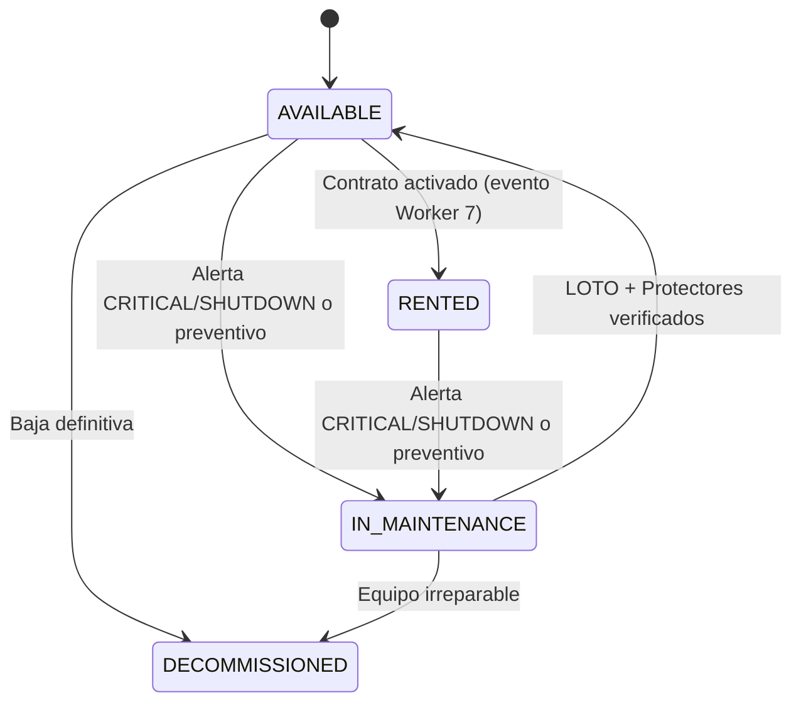
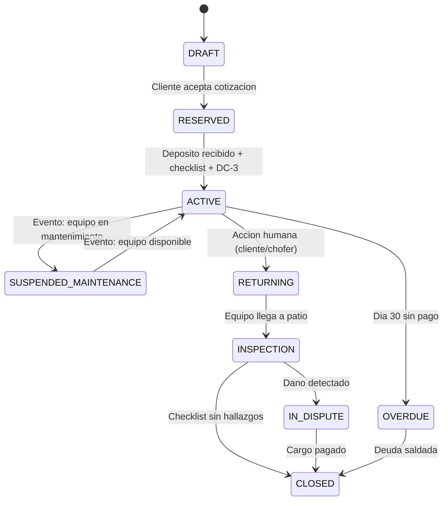
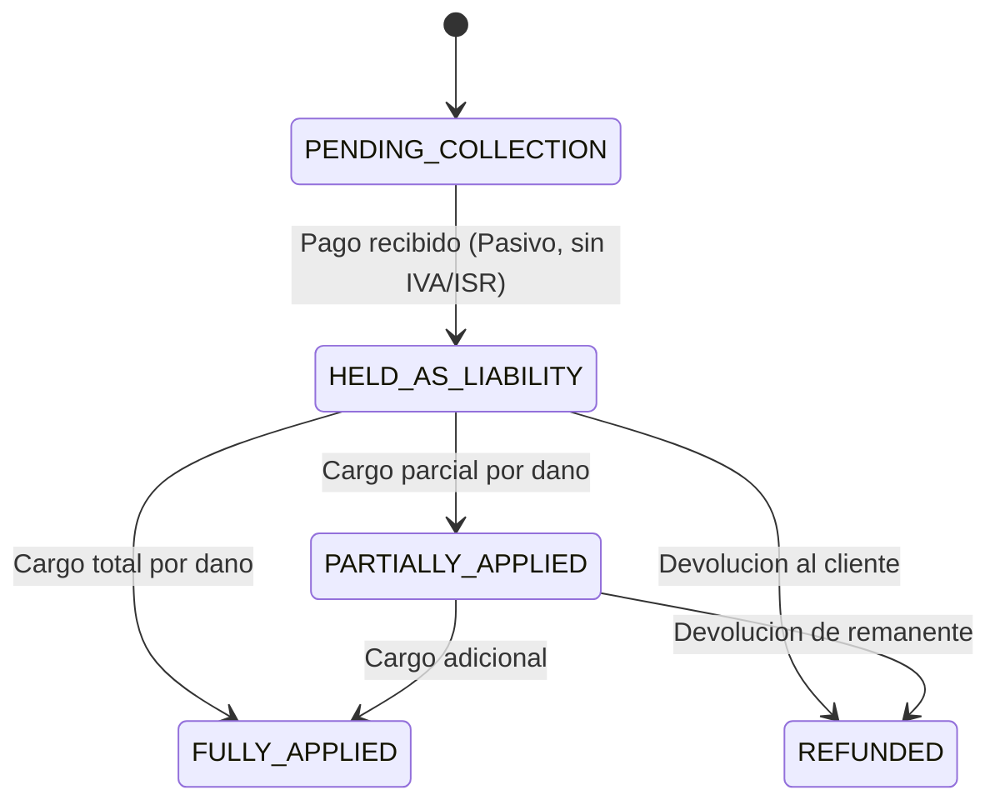
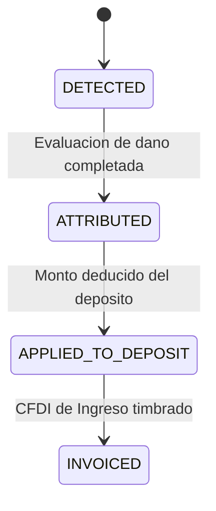

# State Machines de RentMaq Pro

El sistema opera 4 maquinas de estado. Las dos principales (`equipment.current_status` y `rental_contracts.status`) son concurrentes e independientes -- ver No-Join Rule en `CLAUDE.md` Seccion 1.

---

## 1. equipment.current_status (Estado Fisico del Activo)

Operada exclusivamente por el Worker 3 (MaintenanceOrchestrationWorker).

| Transicion | Disparador | Worker | Gate |
|-----------|-----------|--------|------|
| AVAILABLE -> RENTED | Evento: contrato activado | Worker 7 (evento) -> Worker 3 (transicion) | Certificacion ANSI A92 vigente (plataformas) |
| AVAILABLE -> IN_MAINTENANCE | Alerta CRITICAL/SHUTDOWN o cron preventivo | Worker 3 | Ninguno |
| RENTED -> IN_MAINTENANCE | Alerta CRITICAL/SHUTDOWN | Worker 3 | Ninguno |
| IN_MAINTENANCE -> AVAILABLE | Orden completada | Worker 3 | `loto_applied = TRUE` AND `protectors_reinstalled = TRUE` |
| AVAILABLE -> DECOMMISSIONED | Decision administrativa | Manual | Ninguno |
| IN_MAINTENANCE -> DECOMMISSIONED | Equipo irreparable | Manual | Ninguno |

---

## 2. rental_contracts.status (Estado Financiero del Contrato)

Operada exclusivamente por el Worker 7 (ContractLifecycleWorker). NUNCA consulta `equipment.current_status`.

| Transicion | Disparador | Condiciones |
|-----------|-----------|-------------|
| RESERVED -> ACTIVE | Accion usuario | Deposito recibido + checklist pre-entrega + DC-3 operador |
| ACTIVE -> RETURNING | Accion humana | Cliente en Portal o chofer en App. Excepcion: recoleccion forzada dia 60 |
| INSPECTION -> CLOSED | Automatico | Checklist post-devolucion sin hallazgos |
| OVERDUE -> escalacion | Cron | Dia 30: notificacion. Dia 60: recoleccion forzada. Dia 90: cobranza juridica |

---

## 3. deposits.status (Ciclo de Vida del Deposito)

Constraint de base de datos: `applied_amount + refunded_amount <= amount` (CHECK en tabla `deposits`).

---

## 4. extraordinary_charges.status (Cargos Extraordinarios)

| Transicion | Worker Responsable |
|-----------|-------------------|
| DETECTED -> ATTRIBUTED | Manual (evaluador de patio) |
| ATTRIBUTED -> APPLIED_TO_DEPOSIT | Worker 4 (FinancialImpactWorker) |
| APPLIED_TO_DEPOSIT -> INVOICED | Worker 5 (CfdiLifecycleWorker) |

---

Ultima actualizacion: 2026-04-06. Responsable: Arquitectura. Estado: Vigente.
