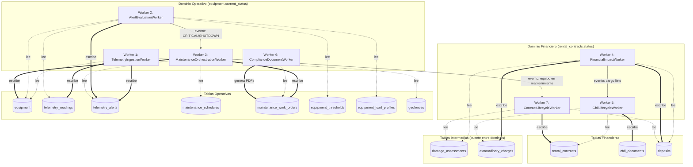

# Interaccion entre Workers

Diagrama de interaccion entre los 7 workers de RentMaq Pro, agrupados por dominio. Las flechas solidas representan escritura; las punteadas representan lectura. La comunicacion entre dominios se realiza exclusivamente mediante tablas intermedias (No-Join Rule).

---

## Diagrama de Flujo



---

## Matriz de Lectura/Escritura por Worker

| Worker | Lee | Escribe |
|--------|-----|---------|
| W1: TelemetryIngestion | `equipment`, `geofences` | `telemetry_readings`, `telemetry_alerts` |
| W2: AlertEvaluation | `telemetry_readings`, `equipment`, `equipment_thresholds`, `equipment_load_profiles` | `telemetry_alerts` |
| W3: MaintenanceOrchestration | `telemetry_alerts`, `maintenance_schedules` | `maintenance_work_orders`, `equipment.current_status` |
| W6: ComplianceDocument | `maintenance_work_orders` | PDFs (bitacora NOM-004, protocolo LOTO) |
| W4: FinancialImpact | `damage_assessments`, `deposits` | `extraordinary_charges`, `deposits` |
| W5: CfdiLifecycle | `extraordinary_charges`, `rental_contracts` | `cfdi_documents` |
| W7: ContractLifecycle | `damage_assessments`, `deposits` | `rental_contracts` |

---

## Reglas de Desacoplamiento

1. **Workers operativos (1, 2, 3, 6):** NUNCA leen `rental_contracts.status`.
2. **Workers financieros (4, 5, 7):** NUNCA leen `equipment.current_status`.
3. La comunicacion entre dominios se realiza mediante tablas intermedias: `telemetry_alerts`, `damage_assessments`, `extraordinary_charges`.
4. Verificacion automatizada:

```bash
# Debe retornar cero resultados
grep -r "current_status" src/RentMaq.Workers/Financial/
grep -r "rental_contracts" src/RentMaq.Workers/Operational/
```

---

Ultima actualizacion: 2026-04-06. Responsable: Arquitectura. Estado: Vigente.
